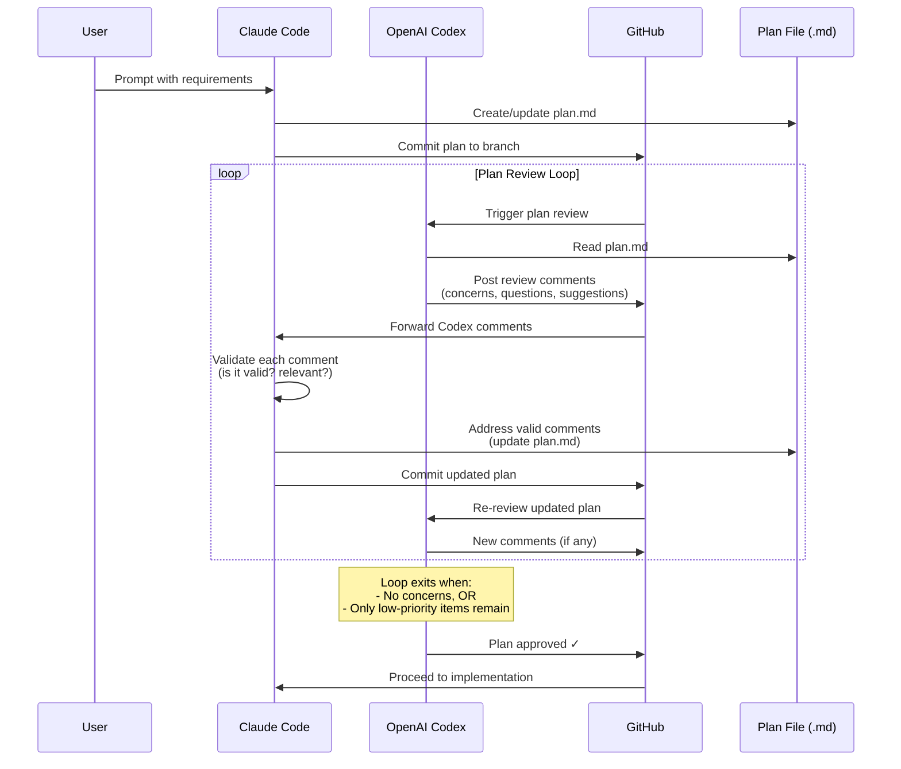
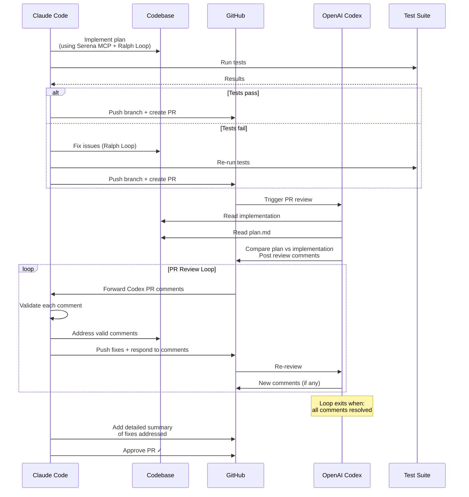
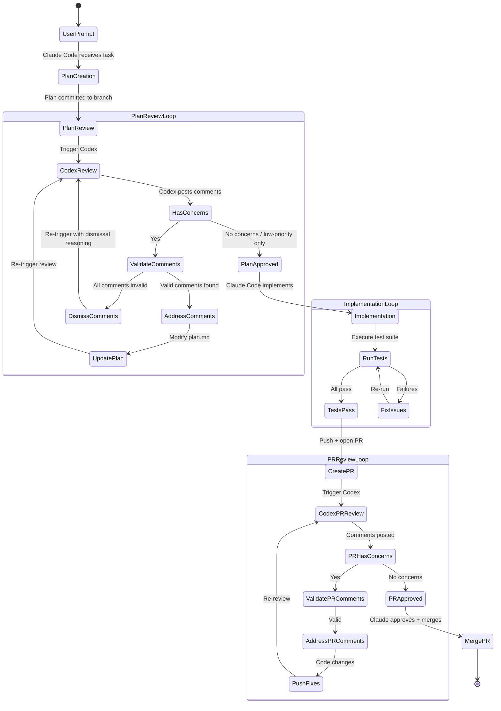
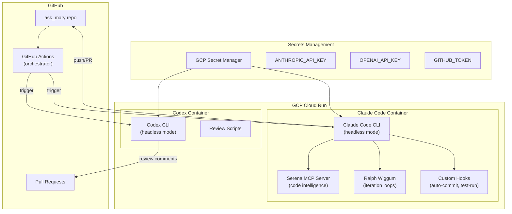
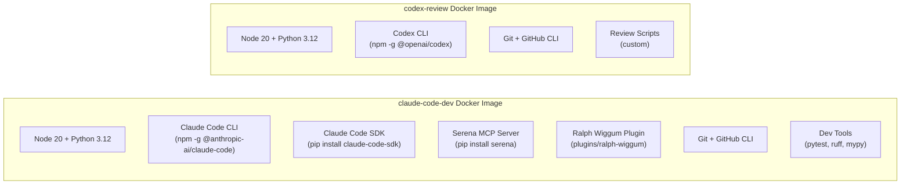
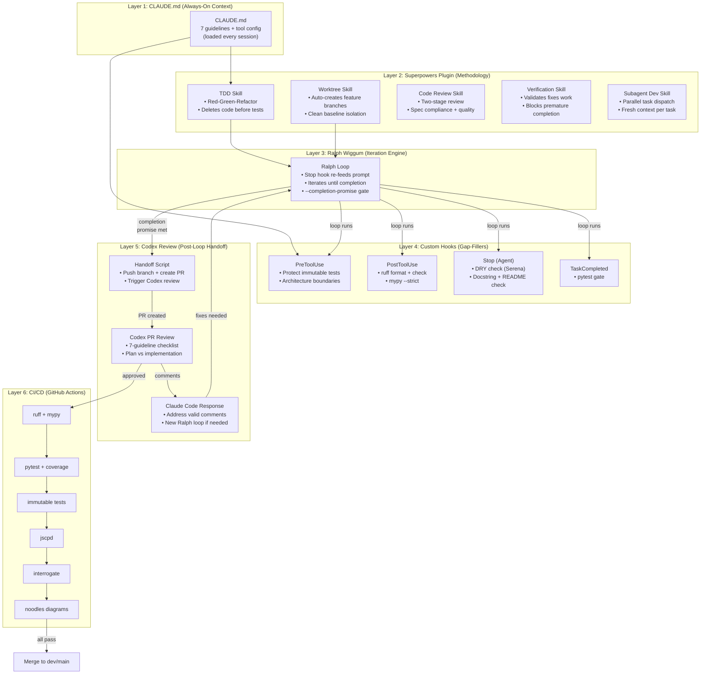
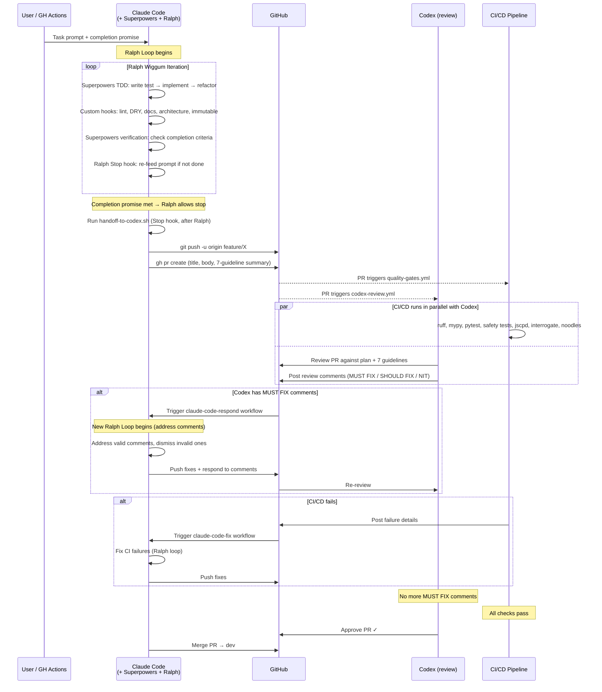

# Agent Development Workflow: Claude Code + Codex Iteration Infrastructure

## Linked from: `ask_mary_plan.md` Phase 1

---

## Table of Contents

1. [Overview](#1-overview)
2. [Iteration Loop Specification](#2-iteration-loop-specification)
3. [Architecture](#3-architecture)
4. [GCP Infrastructure](#4-gcp-infrastructure)
5. [Docker Configuration](#5-docker-configuration)
6. [Claude Code Configuration](#6-claude-code-configuration)
7. [Codex Configuration](#7-codex-configuration)
8. [Automation Scripts](#8-automation-scripts)
9. [Implementation Plan](#9-implementation-plan)
10. [Security Considerations](#10-security-considerations)
11. [Development Standards & Enforcement Configuration](#11-development-standards--enforcement-configuration)

---

## 1. Overview

This document defines the infrastructure and automation required to run the **Claude Code + Codex iteration loop** — a continuous plan-then-implement-then-review workflow that enables autonomous code development with structured quality gates.

### Key Components

| Component | Purpose | Runtime |
|-----------|---------|---------|
| **Claude Code** (headless) | Plan creation, implementation, comment response | GCP Docker container |
| **OpenAI Codex** (headless) | Plan review, PR review, comment generation | GCP Docker container |
| **Serena MCP** | Semantic code intelligence for Claude Code | MCP server in container |
| **Ralph Wiggum Plugin** | Autonomous iteration loops for Claude Code | Claude Code plugin |
| **GitHub Actions** | Orchestrates the iteration loop triggers | GitHub-hosted |
| **GCP Cloud Run** | Hosts the dev containers | Google Cloud |

---

## 2. Iteration Loop Specification

### 2.1 Plan Iteration Loop



### 2.2 Implementation + PR Review Loop



### 2.3 Full Lifecycle State Machine



---

## 3. Architecture

### 3.1 Infrastructure Architecture



### 3.2 Container Architecture



---

## 4. GCP Infrastructure

### 4.1 Services Required

| Service | Purpose | Config |
|---------|---------|--------|
| **Cloud Run** | Run dev containers on-demand | Min instances: 0, Max: 2 |
| **Artifact Registry** | Store Docker images | Region: us-central1 |
| **Secret Manager** | API keys and tokens | Auto-rotate enabled |
| **Cloud Build** | Build Docker images | Triggered on Dockerfile changes |
| **Cloud Logging** | Container logs | Retained 30 days |

### 4.2 Estimated Cost (Hackathon)

| Resource | Usage | Cost |
|----------|-------|------|
| Cloud Run (Claude Code) | ~4h/day active | ~$2-5/day |
| Cloud Run (Codex) | ~1h/day active | ~$1-2/day |
| Artifact Registry | 2 images | < $1/day |
| Secret Manager | 3 secrets | < $0.10/day |
| **Total** | | **~$5-10/day** |

---

## 5. Docker Configuration

### 5.1 Claude Code Container

```
# Dockerfile.claude-code
# =====================
# Image: claude-code-dev
# Contains: Claude Code CLI, SDK, Serena MCP, Ralph Wiggum, dev tools

Base: node:20-bookworm
Layers:
  1. System deps (git, python3.12, gh CLI)
  2. Claude Code CLI (npm install -g @anthropic-ai/claude-code)
  3. Claude Code SDK (pip install claude-code-sdk)
  4. Serena MCP (pip install serena)
  5. Ralph Wiggum plugin (copy from anthropics/claude-code repo)
  6. Project dev dependencies (pip install -r requirements-dev.txt)
  7. Custom hooks and automation scripts

Environment:
  - ANTHROPIC_API_KEY (from Secret Manager)
  - GITHUB_TOKEN (from Secret Manager)
  - CLAUDE_CODE_HEADLESS=1

Entrypoint: automation/run_workflow.sh
```

### 5.2 Codex Container

```
# Dockerfile.codex
# =================
# Image: codex-review
# Contains: Codex CLI, review scripts

Base: node:20-bookworm
Layers:
  1. System deps (git, python3.12, gh CLI)
  2. Codex CLI (npm install -g @openai/codex)
  3. Custom review scripts

Environment:
  - OPENAI_API_KEY (from Secret Manager)
  - GITHUB_TOKEN (from Secret Manager)

Entrypoint: automation/run_review.sh
```

---

## 6. Claude Code Configuration

### 6.1 Serena MCP Server Setup

Serena provides IDE-like semantic code intelligence to Claude Code, enabling:
- Symbol-level navigation across 20+ languages
- Semantic code search (not just grep)
- Precise code editing (by symbol, not by line)
- Cross-file reference tracking

**Configuration** (`.claude/settings.json`):
```json
{
  "mcpServers": {
    "serena": {
      "command": "serena",
      "args": ["--project-root", "."],
      "env": {}
    }
  }
}
```

**Why Serena matters for this project**: Our multi-agent codebase will have many interconnected Python modules. Serena gives Claude Code the ability to understand symbol relationships (e.g., "find all callers of `verify_identity()`") rather than doing fragile text grep, which dramatically improves the quality of autonomous refactoring and implementation.

### 6.2 Ralph Wiggum Plugin Setup

Ralph Wiggum enables Claude Code to run in autonomous iteration loops within a session. Instead of stopping after one pass, Claude Code re-reads its prompt and continues working until the task is complete.

**Installation**:
```bash
# Clone the plugin from the official anthropics/claude-code repo
cp -r plugins/ralph-wiggum ~/.claude/plugins/ralph-wiggum
```

**Usage in automation**:
- `/ralph-loop` — Start an autonomous loop in the current session
- `/cancel-ralph` — Cancel the active loop
- The loop continues until: task is fully complete, or max iterations reached

**When to use Ralph**:
- Implementing a full plan (multiple files, multiple steps)
- Large refactors (batch operations across codebase)
- Fixing cascading test failures
- Greenfield builds where completion criteria are clear

### 6.3 Custom Hooks

> **See Section 11** for the complete hooks configuration enforcing all 7 development guidelines (DRY, Clean Code, TDD, Microservices, Worktrees, Immutable Tests, Documentation).

Summary of hooks deployed:

| Event | Hook Type | Purpose |
|-------|-----------|---------|
| `SessionStart` | Command | Warn if on main/dev (worktree check) |
| `PreToolUse` (Write\|Edit) | Command | Block edits to `tests/safety/` (immutable tests) |
| `PreToolUse` (Write\|Edit) | Prompt | Validate microservices architecture boundaries |
| `PostToolUse` (Write\|Edit) | Command | Run `ruff format` + `ruff check` + `mypy` on changed files |
| `Stop` | Agent | Verify TDD compliance, DRY compliance, documentation coverage |
| `TaskCompleted` | Command | Run `pytest` — block task completion if tests fail |

Full configuration in `.claude/settings.json` — see Section 11.8.

---

## 7. Codex Configuration

### 7.1 Plan Review Mode

Codex reviews plan files with a structured prompt:

```
Review the implementation plan in local_docs/*.md.

For each section, evaluate:
1. Feasibility: Can this be built in the stated timeframe?
2. Completeness: Are there missing steps or edge cases?
3. Safety: Are there security or compliance gaps?
4. Architecture: Are there better patterns or approaches?
5. Consistency: Does the plan contradict itself anywhere?

Output format:
- CONCERN [HIGH/MEDIUM/LOW]: Description of the concern
- QUESTION: Clarifying question about an ambiguity
- SUGGESTION: Optional improvement (not blocking)

Do NOT flag:
- Style preferences
- Naming conventions (unless confusing)
- Things already marked as TODO/future work
```

### 7.2 PR Review Mode

```
Review this PR against the implementation plan in local_docs/ask_mary_plan.md.

Compare:
1. Does the implementation match the plan?
2. Are there deviations? If so, are they justified?
3. Do all immutable safety tests pass?
4. Are there security vulnerabilities?
5. Is the code maintainable by autonomous agents?

Output format:
- MUST FIX: Blocking issue that must be resolved
- SHOULD FIX: Important but non-blocking
- NIT: Minor suggestion
- QUESTION: Need clarification from implementer
```

---

## 8. Automation Scripts

### 8.1 Workflow Orchestrator (`automation/run_workflow.sh`)

```
#!/bin/bash
# Orchestrates the full Claude Code + Codex iteration loop
# Triggered by GitHub Actions or manually

Phases:
  1. PLAN
     - Claude Code creates plan from user prompt
     - Commits to feature branch
     - Triggers plan review

  2. PLAN_REVIEW
     - Codex reviews plan
     - Posts comments to PR
     - Claude Code addresses comments
     - Loop until approved

  3. IMPLEMENT
     - Claude Code implements plan (with Ralph Loop)
     - Serena MCP for code intelligence
     - Runs tests continuously
     - Pushes implementation PR

  4. PR_REVIEW
     - Codex reviews PR against plan
     - Claude Code addresses comments
     - Loop until approved

  5. MERGE
     - Claude Code approves and merges
     - Triggers deployment pipeline
```

### 8.2 GitHub Actions Workflow

```yaml
# .github/workflows/dev-loop.yml
name: Agent Dev Loop

on:
  workflow_dispatch:
    inputs:
      task_prompt:
        description: 'Task description for Claude Code'
        required: true
      phase:
        description: 'Starting phase'
        type: choice
        options: [plan, implement, review]

jobs:
  claude-code-plan:
    if: inputs.phase == 'plan'
    runs-on: ubuntu-latest
    container:
      image: us-central1-docker.pkg.dev/$PROJECT/ask-mary/claude-code-dev:latest
    steps:
      - checkout
      - run: claude -p "${{ inputs.task_prompt }}" --headless --output-format json

  codex-review:
    needs: claude-code-plan
    runs-on: ubuntu-latest
    container:
      image: us-central1-docker.pkg.dev/$PROJECT/ask-mary/codex-review:latest
    steps:
      - checkout
      - run: codex --approval-mode full-auto -p "Review plan..." --headless

  claude-code-respond:
    needs: codex-review
    runs-on: ubuntu-latest
    container:
      image: us-central1-docker.pkg.dev/$PROJECT/ask-mary/claude-code-dev:latest
    steps:
      - checkout
      - run: claude -p "Address review comments..." --headless
```

---

## 9. Implementation Plan

### Phase Order (fits into Ask Mary Phase 1)

| Step | Task | Duration | Details |
|------|------|----------|---------|
| 9.1 | Create GCP project + enable APIs | 15 min | Cloud Run, Artifact Registry, Secret Manager |
| 9.2 | Store secrets in Secret Manager | 10 min | ANTHROPIC_API_KEY, OPENAI_API_KEY, GITHUB_TOKEN |
| 9.3 | Build Claude Code Docker image | 30 min | Dockerfile with Claude Code, Serena, Ralph Wiggum |
| 9.4 | Build Codex Docker image | 15 min | Dockerfile with Codex CLI + review scripts |
| 9.5 | Push images to Artifact Registry | 10 min | Tag and push both images |
| 9.6 | Deploy to Cloud Run | 15 min | Configure services, env vars, secrets |
| 9.7 | Create GitHub Actions workflows | 20 min | dev-loop.yml with plan/implement/review phases |
| 9.8 | Test iteration loop end-to-end | 20 min | Small test task through full loop |
| **Total** | | **~2.5 hours** | |

**Note**: This can be built in parallel with the main Ask Mary application since it's infrastructure-only.

---

## 10. Security Considerations

| Concern | Mitigation |
|---------|------------|
| API keys in containers | GCP Secret Manager (not env vars in Dockerfile) |
| GitHub token scope | Fine-grained PAT with repo-only access |
| Container escape | Cloud Run sandboxed environment |
| Code injection via prompts | Headless mode limits tool access; hooks validate |
| Cost runaway | Max iterations in Ralph Loop; Cloud Run max instance limits |
| Secrets in logs | Mask secrets in Cloud Logging; no secrets in commit messages |

---

## 11. Development Standards & Enforcement Configuration

This section defines the **7 non-negotiable development guidelines** and the specific mechanisms that enforce each one across the Claude Code + Codex pipeline. Enforcement operates at six layers — two plugin layers (Superpowers + Ralph Wiggum) complement four infrastructure layers:

| Layer | Mechanism | When It Fires | Can Block? |
|-------|-----------|---------------|:----------:|
| **CLAUDE.md** | Always-on instructions loaded at session start | Every session | No (advisory) |
| **Superpowers Plugin** | Skill-based methodology (TDD, worktrees, code review, verification) | Contextual — activates per workflow phase | **Yes** (deletes non-TDD code, blocks unverified completion) |
| **Ralph Wiggum Plugin** | Autonomous iteration loop (Stop hook re-feeds prompt) | During implementation phase | **Yes** (blocks premature stop) |
| **Custom Hooks** | Shell/prompt/agent checks for guidelines Superpowers doesn't cover | On tool calls, stops, task completion | **Yes** |
| **Codex Review** | Structured review prompts (triggered after Ralph loop completes) | Plan review + PR review | **Yes** (comments) |
| **CI/CD** | GitHub Actions pipeline checks | On push / PR | **Yes** (blocks merge) |

### 11.0 Enforcement Architecture



### 11.0.1 How the Layers Compose

The key insight is that **Superpowers, Ralph Wiggum, and our custom hooks are not competing** — they operate at different granularities:

| Concern | Who Handles It | Why |
|---------|---------------|-----|
| **TDD methodology** (write test → implement → refactor) | **Superpowers** `test-driven-development` skill | It *deletes code written before tests* — more aggressive than a hook can be |
| **Git worktree creation** | **Superpowers** `using-git-worktrees` skill | Auto-creates branches with clean baselines |
| **Subagent task dispatch** | **Superpowers** `subagent-driven-development` skill | Two-stage review per task (spec + quality) |
| **Autonomous iteration** (keep working for hours) | **Ralph Wiggum** Stop hook | Re-feeds prompt until completion promise met |
| **Code formatting** (ruff, mypy) | **Custom hook** (PostToolUse) | Superpowers doesn't lint — we need real tooling |
| **DRY enforcement** (Serena cross-ref) | **Custom hook** (Stop agent) | Superpowers has no duplicate detection |
| **Immutable test protection** | **Custom hook** (PreToolUse deny) | Superpowers has no file-locking concept |
| **Architecture boundaries** | **Custom hook** (PreToolUse prompt) | Superpowers doesn't check import directions |
| **Documentation** (docstrings, README) | **Custom hook** (Stop agent) | Superpowers doesn't check docstrings |
| **7-guideline PR review** | **Codex** (post-loop handoff) | Independent reviewer with full checklist |
| **Final quality gates** | **CI/CD** (GitHub Actions) | Non-bypassable, deterministic checks |

### 11.0.2 Ralph Wiggum → Codex Handoff Orchestration

This is the critical seam: when the Ralph Wiggum loop completes, we need an automatic handoff to Codex for review. Here is the full handoff flow:



**Handoff mechanism — three scripts:**

**1. `handoff-to-codex.sh`** (runs as Stop hook, after Ralph completes):
```bash
#!/bin/bash
# Runs AFTER Ralph Wiggum's Stop hook allows Claude to stop.
# Pushes branch, creates PR, and triggers Codex review.

INPUT=$(cat)
STOP_HOOK_ACTIVE=$(echo "$INPUT" | jq -r '.stop_hook_active // false')

# Only run if Ralph loop has COMPLETED (not still iterating)
# Check: if there's a .ralph-complete marker file
if [ ! -f "$CLAUDE_PROJECT_DIR/.ralph-complete" ]; then
  exit 0  # Ralph hasn't signaled completion yet — don't handoff
fi

# Clean up marker
rm -f "$CLAUDE_PROJECT_DIR/.ralph-complete"

BRANCH=$(git -C "$CLAUDE_PROJECT_DIR" rev-parse --abbrev-ref HEAD)

# Push branch and create PR
cd "$CLAUDE_PROJECT_DIR"
git push -u origin "$BRANCH" 2>&1

# Create PR with 7-guideline summary
gh pr create \
  --title "$(git log -1 --format=%s)" \
  --body "$(cat <<'PREOF'
## Auto-generated PR from Claude Code + Ralph Wiggum loop

### Compliance Summary
- [ ] DRY: Shared utilities in src/shared/, no duplication
- [ ] Clean Code: ruff + mypy passing, functions <20 lines
- [ ] TDD: Tests written before implementation
- [ ] Architecture: No cross-boundary imports
- [ ] Immutable Tests: tests/safety/ unchanged
- [ ] Documentation: Docstrings + README.md present
- [ ] Plan compliance: Implementation matches plan

### Review requested from Codex
This PR is ready for automated review via the codex-review workflow.
PREOF
)" 2>&1

echo "PR created. Codex review will be triggered by GitHub Actions." >&2
exit 0
```

**2. GitHub Actions: `codex-review.yml`** (triggered on PR creation):
```yaml
# .github/workflows/codex-review.yml
name: Codex Review

on:
  pull_request:
    types: [opened, synchronize]  # Runs on new PRs and when new commits are pushed

jobs:
  codex-review:
    runs-on: ubuntu-latest
    container:
      image: us-central1-docker.pkg.dev/${{ vars.GCP_PROJECT }}/ask-mary/codex-review:latest
    steps:
      - uses: actions/checkout@v4
        with:
          fetch-depth: 0

      - name: Review PR against plan + 7 guidelines
        env:
          OPENAI_API_KEY: ${{ secrets.OPENAI_API_KEY }}
          GITHUB_TOKEN: ${{ secrets.GITHUB_TOKEN }}
        run: |
          codex --approval-mode full-auto -p "$(cat <<'REVIEW_PROMPT'
          Review PR #${{ github.event.pull_request.number }} against local_docs/ask_mary_plan.md.

          MANDATORY (MUST FIX if violated):
          1. TDD: Check git log — were tests committed BEFORE implementation?
          2. DRY: Are there duplicated functions that should be in src/shared/?
          3. Clean Code: Functions <20 lines? Type hints? Descriptive names?
          4. Architecture: agents/ must not import agents/, services/ must not import agents/
          5. Immutable Tests: Were any files in tests/safety/ modified?
          6. Documentation: Public functions have docstrings? New dirs have README.md?
          7. Plan: Does implementation match the plan?

          Post review comments via gh CLI. Use: MUST FIX / SHOULD FIX / NIT / QUESTION.
          REVIEW_PROMPT
          )" --headless
```

**3. GitHub Actions: `claude-respond.yml`** (triggered to address review comments):
```yaml
# .github/workflows/claude-respond.yml
name: Claude Code Respond to Review

on:
  workflow_dispatch:
    inputs:
      pr_number:
        description: 'PR number to address comments on'
        required: true
      iteration_limit:
        description: 'Max Ralph iterations for fixes'
        default: '10'

jobs:
  address-comments:
    runs-on: ubuntu-latest
    container:
      image: us-central1-docker.pkg.dev/${{ vars.GCP_PROJECT }}/ask-mary/claude-code-dev:latest
    steps:
      - uses: actions/checkout@v4
        with:
          fetch-depth: 0
          ref: ${{ github.event.pull_request.head.ref }}

      - name: Address Codex review comments
        env:
          ANTHROPIC_API_KEY: ${{ secrets.ANTHROPIC_API_KEY }}
          GITHUB_TOKEN: ${{ secrets.GITHUB_TOKEN }}
        run: |
          # Fetch open review comments
          COMMENTS=$(gh pr view ${{ inputs.pr_number }} --comments --json comments -q '.comments[].body')

          claude -p "$(cat <<PROMPT
          Address the following review comments on PR #${{ inputs.pr_number }}.

          REVIEW COMMENTS:
          $COMMENTS

          For each comment:
          1. If valid: fix the code, respond to the comment confirming the fix
          2. If invalid: respond with your reasoning for dismissing it
          3. Push all fixes

          Follow all 7 development guidelines. Use TDD for any code changes.
          Output <promise>ALL_COMMENTS_ADDRESSED</promise> when done.
          PROMPT
          )" --headless

      - name: Push fixes
        run: git push
```

**Completion promise design**: The Ralph Wiggum loop prompt must include instructions to create a `.ralph-complete` marker file and push the PR as the final step:

```
/ralph-loop "Implement [feature] per the plan in local_docs/ask_mary_plan.md.

Follow all 7 development guidelines (enforced by hooks):
- TDD: write failing test first, then implement, then refactor
- DRY: check Serena MCP before writing new functions
- Clean Code: ruff + mypy must pass (enforced by PostToolUse hook)
- Architecture: respect module boundaries
- Documentation: docstrings on all public functions + README.md per directory

When ALL of the following are true:
  1. All planned features are implemented
  2. All tests pass (pytest)
  3. ruff + mypy have no errors
  4. All public functions have docstrings
  5. README.md exists in each new src/ directory

Then:
  - Run: touch .ralph-complete
  - Output: <promise>IMPLEMENTATION_COMPLETE</promise>
" --completion-promise "IMPLEMENTATION_COMPLETE" --max-iterations 50
```

### 11.1 Guideline 1: DRY (Don't Repeat Yourself)

> **Goal**: Ensure Claude Code and Codex use Serena MCP to find and reuse existing functions, creating a central point of failure for shared logic.

**CLAUDE.md enforcement** (advisory, always loaded):
```
## DRY — Do Not Repeat Yourself

Before writing ANY new function or class:
1. Use Serena MCP `find_symbol` to search for functions with similar names
2. Use Serena MCP `find_referencing_symbols` to understand usage patterns
3. If similar functionality exists in src/shared/, IMPORT and REUSE it
4. If you're writing the same logic for the 2nd time, extract it to src/shared/

Shared module structure:
  src/shared/
    db.py          — Database helpers (CRUD, event logging, idempotency)
    validators.py  — Input validation (phone, DOB, ZIP, address)
    comms.py       — Template rendering, channel selection
    auth.py        — Identity verification helpers
    types.py       — Shared Pydantic models and enums

NEVER duplicate:
  - Database query patterns → use shared CRUD functions
  - Validation logic → use shared validators
  - Twilio/ElevenLabs API calls → use shared client wrappers
  - Event logging → use the central log_event() function
```

**Hook enforcement** (Stop hook — agent-based):
```json
{
  "hooks": {
    "Stop": [
      {
        "hooks": [
          {
            "type": "agent",
            "prompt": "Before allowing Claude to stop, verify DRY compliance. Use Grep and Read to check: (1) Are there any functions in the changed files that duplicate logic already in src/shared/? (2) Are there any copy-pasted code blocks longer than 5 lines that appear in multiple files? If violations found, respond with {\"ok\": false, \"reason\": \"DRY violation: [specific duplication found]. Extract to src/shared/ and import.\"}. Context: $ARGUMENTS",
            "timeout": 60
          }
        ]
      }
    ]
  }
}
```

**CI/CD enforcement** (GitHub Actions):
```yaml
# Duplicate code detection
- name: Check for code duplication
  run: |
    pip install jscpd
    jscpd src/ --min-lines 5 --min-tokens 50 --threshold 3 --format json --output .jscpd-report.json
    # Fail if duplication exceeds 3%
```

**Codex review prompt addition**:
```
DRY CHECK:
- Are there functions that duplicate logic already in src/shared/?
- Are there utility functions that should be extracted to shared modules?
- Is there copy-pasted code that could be a shared import?
Flag as MUST FIX if: identical logic appears in 2+ files and is not imported from a shared module.
```

---

### 11.2 Guideline 2: Clean Code (Robert C. Martin)

> **Goal**: All code follows Clean Code Handbook principles — readable, well-named, small functions, minimal comments (code should be self-documenting).

**CLAUDE.md enforcement**:
```
## Clean Code Standards (Robert C. Martin)

Functions:
  - Max 20 lines per function (hard limit). If longer, refactor.
  - Single Responsibility: each function does ONE thing
  - Max 3 parameters per function. Use Pydantic models for more.
  - Verb-noun naming: verify_identity(), log_event(), book_slot()

Naming:
  - Variables: descriptive, no abbreviations (participant not pt, appointment not appt)
  - Booleans: is_verified, has_consent, can_contact (prefix with is/has/can/should)
  - Constants: UPPER_SNAKE_CASE
  - Classes: PascalCase, nouns (ScreeningAgent, HandoffQueue)
  - Modules: snake_case

Code Quality:
  - No magic numbers. Use named constants or enums.
  - No nested conditionals deeper than 2 levels. Use early returns.
  - No commented-out code. Delete it (git has history).
  - Imports: stdlib → third-party → local, alphabetized within groups
  - Type hints on ALL function signatures (enforced by mypy --strict)

Formatter: ruff format (Black-compatible, faster)
Linter: ruff check (replaces flake8, isort, pyflakes, etc.)
Type checker: mypy --strict
```

**Hook enforcement** (PostToolUse — runs after every file write/edit):
```json
{
  "hooks": {
    "PostToolUse": [
      {
        "matcher": "Write|Edit",
        "hooks": [
          {
            "type": "command",
            "command": "\"$CLAUDE_PROJECT_DIR\"/.claude/hooks/lint-and-format.sh"
          }
        ]
      }
    ]
  }
}
```

**`.claude/hooks/lint-and-format.sh`**:
```bash
#!/bin/bash
# Runs ruff format + ruff check + mypy on changed Python files
INPUT=$(cat)
FILE_PATH=$(echo "$INPUT" | jq -r '.tool_input.file_path // empty')

# Only check Python files
if [[ "$FILE_PATH" != *.py ]]; then
  exit 0
fi

# Format check (non-blocking — feeds back to Claude)
FORMAT_OUTPUT=$(ruff format --check "$FILE_PATH" 2>&1)
if [ $? -ne 0 ]; then
  ruff format "$FILE_PATH"  # Auto-fix
fi

# Lint check (blocking if errors)
LINT_OUTPUT=$(ruff check "$FILE_PATH" --fix 2>&1)
LINT_EXIT=$?

# Type check (blocking if errors)
MYPY_OUTPUT=$(mypy "$FILE_PATH" --strict --no-error-summary 2>&1)
MYPY_EXIT=$?

if [ $LINT_EXIT -ne 0 ] || [ $MYPY_EXIT -ne 0 ]; then
  echo "Clean code violations found:" >&2
  [ $LINT_EXIT -ne 0 ] && echo "LINT: $LINT_OUTPUT" >&2
  [ $MYPY_EXIT -ne 0 ] && echo "TYPE: $MYPY_OUTPUT" >&2
  exit 2  # Block — Claude must fix
fi

exit 0
```

**CI/CD enforcement**:
```yaml
- name: Lint and format check
  run: |
    ruff check src/ tests/ --output-format github
    ruff format --check src/ tests/
    mypy src/ --strict
```

---

### 11.3 Guideline 3: Test-Driven Development (TDD)

> **Goal**: Tests are ALWAYS written before implementation. Red → Green → Refactor cycle enforced at every step.

**Primary enforcement: Superpowers `test-driven-development` skill**

Superpowers' TDD skill is the strongest available enforcer — it **deletes implementation code written before tests**. This is more aggressive than any hook can be, because it operates at the methodology level inside Claude's reasoning, not just at the file-write boundary.

The Superpowers TDD skill enforces:
- Write failing test → watch it fail → write minimal code → watch it pass → commit
- Automatic rollback of code written out of order
- Contextual activation: skill triggers whenever Claude starts implementing

**CLAUDE.md enforcement** (reinforces Superpowers, guides commit messages):
```
## TDD — Test-Driven Development (MANDATORY)

Primary enforcer: Superpowers test-driven-development skill (auto-activates).

Additional rules:
  - Test files mirror source: src/agents/screening.py → tests/agents/test_screening.py
  - Test function names describe behavior: test_identity_rejects_wrong_dob()
  - Use pytest + pytest-asyncio for async code
  - Use fixtures in conftest.py for shared test setup
  - Mock external services (Twilio, ElevenLabs, Databricks) — never call real APIs in tests
  - Minimum coverage target: 80% (measured by pytest-cov)

Commit pattern for TDD:
  - "test: add failing test for [feature]"     ← RED
  - "feat: implement [feature]"                 ← GREEN
  - "refactor: clean up [feature]"              ← REFACTOR
```

**Hook enforcement** (TaskCompleted — pytest gate remains as safety net):
```json
{
  "hooks": {
    "TaskCompleted": [
      {
        "hooks": [
          {
            "type": "command",
            "command": "\"$CLAUDE_PROJECT_DIR\"/.claude/hooks/enforce-tdd.sh"
          }
        ]
      }
    ]
  }
}
```

**`.claude/hooks/enforce-tdd.sh`**:
```bash
#!/bin/bash
# Block task completion if tests don't pass (safety net behind Superpowers TDD)
RESULT=$(cd "$CLAUDE_PROJECT_DIR" && python -m pytest tests/ --tb=short -q 2>&1)
EXIT_CODE=$?

if [ $EXIT_CODE -ne 0 ]; then
  echo "TDD gate failed — tests must pass before task completion:" >&2
  echo "$RESULT" >&2
  exit 2  # Block task completion
fi

exit 0
```

**CI/CD enforcement**:
```yaml
- name: Run test suite with coverage
  run: |
    pytest tests/ --cov=src --cov-report=xml --cov-fail-under=80 -v
```

> **Note**: The Stop agent hook for TDD (checking test existence) has been **removed** — Superpowers' TDD skill handles this more effectively at the methodology level. The TaskCompleted pytest gate remains as a deterministic safety net.

---

### 11.4 Guideline 4: Microservices Architecture

> **Goal**: Code is organized into well-defined service modules with clear boundaries, interfaces, and minimal cross-service coupling.

**CLAUDE.md enforcement**:
```
## Microservices Architecture

Project structure — each service is a self-contained module:
  src/
    agents/           # Agent implementations (one file per agent)
      orchestrator.py
      outreach.py
      identity.py
      screening.py
      scheduling.py
      transport.py
      comms.py
      supervisor.py
      adversarial.py
    safety/           # Safety gate (inline check, not a full agent)
      gate.py
      triggers.py
    services/         # External service clients (single responsibility)
      twilio_client.py
      elevenlabs_client.py
      calendar_client.py
      uber_client.py   # Mock for MVP
      gcs_client.py
    db/               # Database layer
      postgres.py     # SQLAlchemy models + CRUD
      databricks.py   # Read-only analytics connector
      events.py       # Append-only event logging
    shared/           # Cross-cutting shared utilities
      types.py        # Pydantic models, enums, constants
      validators.py   # Input validation
      comms.py        # Template rendering
      auth.py         # Auth helpers
    api/              # FastAPI routes
      webhooks.py     # Twilio/ElevenLabs webhooks
      dashboard.py    # Dashboard REST API
      health.py       # Health check endpoint
    workers/          # Background task handlers
      reminders.py    # Cloud Tasks callbacks
      cdc.py          # Pub/Sub → Databricks bridge
    config/           # Configuration
      settings.py     # Pydantic Settings (env vars)
  comms_templates/    # YAML templates (NOT in src/)
  tests/              # Mirror of src/ structure

Rules:
  - Agents NEVER import from other agents. They communicate via orchestrator handoffs.
  - Services NEVER import from agents. Agents import services.
  - shared/ can be imported by anyone. Nothing imports from shared/ into shared/.
  - db/ is accessed through defined interfaces, not raw SQL in agent code.
  - Each module exposes a clear public interface (__all__ or explicit exports).
  - No circular imports. Dependency flows: api → agents → services → db → shared
```

**Hook enforcement** (PreToolUse — prompt-based, checks architecture boundaries):
```json
{
  "hooks": {
    "PreToolUse": [
      {
        "matcher": "Write|Edit",
        "hooks": [
          {
            "type": "prompt",
            "prompt": "Check if this file write/edit violates microservices architecture boundaries. Rules: (1) Files in src/agents/ must NOT import from other agent files (agents communicate via orchestrator handoffs only). (2) Files in src/services/ must NOT import from src/agents/. (3) Dependency direction: api → agents → services → db → shared. (4) New Python files must be in the correct directory per the architecture. Input: $ARGUMENTS. Respond {\"ok\": true} if compliant, or {\"ok\": false, \"reason\": \"Architecture violation: [details]\"} if not.",
            "timeout": 15
          }
        ]
      }
    ]
  }
}
```

**Codex review prompt addition**:
```
ARCHITECTURE CHECK:
- Do any agents import directly from other agents? (violation)
- Do services import from agents? (violation)
- Are there circular imports?
- Is the dependency direction correct: api → agents → services → db → shared?
- Are new files placed in the correct module?
Flag as MUST FIX if: cross-boundary imports detected.
```

---

### 11.5 Guideline 5: Git Worktrees for Agent Coding

> **Goal**: Each feature is developed in its own git worktree, enabling parallel development without branch conflicts.

**Primary enforcement: Superpowers `using-git-worktrees` skill**

Superpowers' worktree skill auto-creates isolated branches with clean baselines when a feature task begins. It also handles the `finishing-a-development-branch` lifecycle (merge/PR/discard with cleanup).

**CLAUDE.md enforcement** (reinforces Superpowers, documents naming convention):
```
## Git Worktrees

Primary enforcer: Superpowers using-git-worktrees skill (auto-activates).

Naming convention:
  git worktree add ../ask-mary-{feature-name} -b feature/{feature-name}

Active worktrees:
  ask_mary/                    ← main (production)
  ask-mary-voice-agent/        ← feature/voice-agent
  ask-mary-screening/          ← feature/screening
  ask-mary-dashboard/          ← feature/dashboard

Rules:
  - NEVER develop features directly on main or dev
  - One worktree per major feature
  - Merge to dev first, then dev → main
  - Clean up worktrees after merge: git worktree remove ../ask-mary-{feature}
```

**Hook enforcement** (SessionStart — advisory warning, kept as safety net):
```json
{
  "hooks": {
    "SessionStart": [
      {
        "matcher": "startup",
        "hooks": [
          {
            "type": "command",
            "command": "\"$CLAUDE_PROJECT_DIR\"/.claude/hooks/check-worktree.sh"
          }
        ]
      }
    ]
  }
}
```

**`.claude/hooks/check-worktree.sh`**:
```bash
#!/bin/bash
# Warn if working directly on main or dev (safety net behind Superpowers)
BRANCH=$(git -C "$CLAUDE_PROJECT_DIR" rev-parse --abbrev-ref HEAD 2>/dev/null)

if [ "$BRANCH" = "main" ] || [ "$BRANCH" = "dev" ]; then
  echo "WARNING: You are on '$BRANCH'. For feature work, create a worktree:"
  echo "  git worktree add ../ask-mary-{feature} -b feature/{feature}"
  echo ""
  echo "Active worktrees:"
  git -C "$CLAUDE_PROJECT_DIR" worktree list
fi

exit 0  # Advisory only, doesn't block
```

---

### 11.6 Guideline 6: Immutable Tests

> **Goal**: Safety-critical tests in `tests/safety/` can NEVER be modified or deleted. They must pass for any PR to merge.

**CLAUDE.md enforcement**:
```
## Immutable Tests

Files in tests/safety/ are LOCKED. You MUST NOT:
  - Edit any file in tests/safety/
  - Delete any file in tests/safety/
  - Rename any file in tests/safety/
  - Change the expected outcomes of any safety test

If a safety test fails, the IMPLEMENTATION is wrong, not the test.
Fix the implementation to make the test pass.

The only way to modify tests/safety/ is with explicit human approval
and a documented reason in the commit message.
```

**Hook enforcement** (PreToolUse — blocks writes to safety tests):
```json
{
  "hooks": {
    "PreToolUse": [
      {
        "matcher": "Write|Edit",
        "hooks": [
          {
            "type": "command",
            "command": "\"$CLAUDE_PROJECT_DIR\"/.claude/hooks/protect-immutable.sh"
          }
        ]
      }
    ]
  }
}
```

**`.claude/hooks/protect-immutable.sh`**:
```bash
#!/bin/bash
INPUT=$(cat)
FILE_PATH=$(echo "$INPUT" | jq -r '.tool_input.file_path // empty')

# Block any modification to tests/safety/
if echo "$FILE_PATH" | grep -q "tests/safety/"; then
  jq -n '{
    hookSpecificOutput: {
      hookEventName: "PreToolUse",
      permissionDecision: "deny",
      permissionDecisionReason: "BLOCKED: tests/safety/ is immutable. If a safety test fails, fix the implementation — not the test."
    }
  }'
else
  exit 0
fi
```

**CI/CD enforcement** (GitHub Actions — verify tests/safety/ unchanged):
```yaml
- name: Verify immutable safety tests unchanged
  run: |
    # Compare tests/safety/ against main branch
    CHANGED=$(git diff origin/main --name-only -- tests/safety/)
    if [ -n "$CHANGED" ]; then
      echo "::error::IMMUTABLE TESTS MODIFIED: $CHANGED"
      echo "tests/safety/ files cannot be changed without explicit approval."
      exit 1
    fi

- name: Run immutable safety tests
  run: |
    pytest tests/safety/ -v --tb=long
    # This must ALWAYS pass. No exceptions.
```

---

### 11.7 Guideline 7: Documentation (README, Docstrings, Architecture Diagrams)

> **Goal**: Every module has a README, every public function has docstrings, and architecture diagrams are auto-generated on every PR using Noodles.

**CLAUDE.md enforcement**:
```
## Documentation Standards

README files:
  - Every directory under src/ MUST have a README.md
  - README includes: purpose, key classes/functions, dependencies, usage examples
  - Top-level README.md is the project overview + quickstart

Docstrings (Google style):
  - ALL public functions and classes MUST have docstrings
  - Format: Google style (Args:, Returns:, Raises:, Example:)
  - Include type info in docstring even though type hints exist
  - Private functions (_prefixed) — docstring optional but encouraged

Architecture Diagrams:
  - Run `unslop run` (noodles) to generate interactive code flow diagrams
  - Diagrams stored in docs/architecture/
  - CI/CD auto-generates updated diagrams on every PR
  - Mermaid diagrams in plan docs for high-level architecture
  - Noodles D2 diagrams for code-level flow visualization
```

**Hook enforcement** (Stop hook — agent-based, checks docstrings):
```json
{
  "hooks": {
    "Stop": [
      {
        "hooks": [
          {
            "type": "agent",
            "prompt": "Before allowing Claude to stop, check documentation compliance. (1) For every new/modified Python file, verify all public functions (not _prefixed) have Google-style docstrings. Use Read to inspect the files. (2) If a new directory was created under src/, check that it contains a README.md. If violations found, respond with {\"ok\": false, \"reason\": \"Documentation missing: [specific files/functions without docstrings or directories without README.md]\"}. Context: $ARGUMENTS",
            "timeout": 60
          }
        ]
      }
    ]
  }
}
```

**Noodles integration** (CI/CD — auto-generate architecture diagrams on PR):
```yaml
- name: Generate architecture diagrams (Noodles)
  run: |
    pip install uv
    uv sync  # Install noodles dependencies
    # Generate D2 diagrams for changed code paths
    unslop run --folder src/ --output docs/architecture/
    # Commit updated diagrams if they changed
    git add docs/architecture/
    if ! git diff --cached --quiet docs/architecture/; then
      git commit -m "docs: update architecture diagrams (auto-generated by noodles)"
    fi

- name: Check docstring coverage
  run: |
    pip install interrogate
    interrogate src/ --fail-under 90 --verbose --ignore-init-method --ignore-magic
```

**Noodles setup** (in Docker container):
```
# Additional layer in Dockerfile.claude-code
RUN pip install uv && \
    brew install d2 && \
    git clone https://github.com/unslop-xyz/noodles.git /opt/noodles && \
    cd /opt/noodles && uv sync

Environment:
  - OPENAI_API_KEY (shared with Codex — noodles uses OpenAI for entry point detection)
```

---

### 11.8 Complete Configuration Files

#### CLAUDE.md (full project-level file)

The `CLAUDE.md` file lives at the project root and is loaded by Claude Code at every session start. It is the **single source of truth** for all development guidelines.

```
# Ask Mary — Development Guidelines

## Project Context
AI clinical trial scheduling agent. See local_docs/ask_mary_plan.md for full architecture.

## Plugins Active
- Superpowers: TDD, git worktrees, subagent dev, code review, verification
- Ralph Wiggum: autonomous iteration loops (invoke with /ralph-loop)
- Serena MCP: semantic code intelligence (find_symbol, find_referencing_symbols)

## MANDATORY STANDARDS (enforced by plugins + hooks + CI/CD)

### 1. DRY — Don't Repeat Yourself
- Before writing any new function: search with Serena MCP for existing implementations
- Shared utilities go in src/shared/ (db, validators, comms, auth, types)
- If logic appears in 2+ places, extract to src/shared/ and import

### 2. Clean Code (Robert C. Martin)
- Functions: max 20 lines, single responsibility, max 3 params
- Naming: descriptive verb-noun (verify_identity, log_event), no abbreviations
- Booleans: is_/has_/can_/should_ prefix
- No magic numbers, no nested conditionals >2 deep, no commented-out code
- Type hints on all function signatures (mypy --strict enforced)

### 3. TDD — Test-Driven Development
- Enforced by Superpowers test-driven-development skill (auto-activates)
- RED: Write failing test FIRST. Do NOT write implementation.
- GREEN: Minimum code to pass. Commit.
- REFACTOR: Clean up. Tests must still pass. Commit.
- Test file mirrors source: src/agents/screening.py → tests/agents/test_screening.py
- Mock all external services in tests. Never call real APIs.
- Coverage target: 80%

### 4. Microservices Architecture
- Agents NEVER import from other agents (communicate via orchestrator)
- Services NEVER import from agents
- Dependency direction: api → agents → services → db → shared
- No circular imports

### 5. Git Worktrees
- Enforced by Superpowers using-git-worktrees skill (auto-activates)
- NEVER develop on main or dev directly
- Create worktree: git worktree add ../ask-mary-{feature} -b feature/{feature}

### 6. Immutable Tests
- tests/safety/ is LOCKED. NEVER modify these files.
- If a safety test fails, fix the IMPLEMENTATION, not the test.
- Enforced by PreToolUse hook (blocks writes to tests/safety/)

### 7. Documentation
- Every src/ directory MUST have README.md
- All public functions MUST have Google-style docstrings
- Architecture diagrams auto-generated by noodles on PR

## Tools
- Formatter: ruff format
- Linter: ruff check
- Type checker: mypy --strict
- Test runner: pytest
- Coverage: pytest-cov (80% minimum)
- Docstring coverage: interrogate (90% minimum)
- Duplicate detection: jscpd (3% max)
- Architecture diagrams: noodles (unslop run)
- Code intelligence: Serena MCP (find_symbol, find_referencing_symbols)

## Handoff Protocol
When implementation is complete:
1. Touch .ralph-complete marker
2. Ralph loop exits → handoff-to-codex.sh pushes PR
3. Codex reviews PR against 7 guidelines
4. Address comments → push fixes → Codex re-reviews
5. All CI/CD checks pass → merge to dev
```

#### Plugin Installation

```bash
# Superpowers (methodology layer — TDD, worktrees, code review, verification)
/plugin install superpowers@superpowers-marketplace

# Ralph Wiggum (iteration engine — autonomous loops)
cp -r plugins/ralph-wiggum ~/.claude/plugins/ralph-wiggum
```

Both plugins are loaded at session start. Superpowers skills activate contextually based on workflow phase. Ralph Wiggum activates only when `/ralph-loop` is explicitly invoked.

#### `.claude/settings.json` (complete hooks configuration)

```json
{
  "mcpServers": {
    "serena": {
      "command": "serena",
      "args": ["--project-root", "."],
      "env": {}
    }
  },
  "hooks": {
    "SessionStart": [
      {
        "matcher": "startup",
        "hooks": [
          {
            "type": "command",
            "command": "\"$CLAUDE_PROJECT_DIR\"/.claude/hooks/check-worktree.sh",
            "statusMessage": "Checking git worktree..."
          }
        ]
      }
    ],
    "PreToolUse": [
      {
        "matcher": "Write|Edit",
        "hooks": [
          {
            "type": "command",
            "command": "\"$CLAUDE_PROJECT_DIR\"/.claude/hooks/protect-immutable.sh",
            "statusMessage": "Checking immutable test protection..."
          },
          {
            "type": "prompt",
            "prompt": "Check if this file write/edit violates microservices architecture. Rules: agents/ must NOT import from other agents, services/ must NOT import from agents, dependency direction: api → agents → services → db → shared. Input: $ARGUMENTS. Respond {\"ok\": true} if compliant.",
            "timeout": 15
          }
        ]
      }
    ],
    "PostToolUse": [
      {
        "matcher": "Write|Edit",
        "hooks": [
          {
            "type": "command",
            "command": "\"$CLAUDE_PROJECT_DIR\"/.claude/hooks/lint-and-format.sh",
            "statusMessage": "Running lint + format + type check..."
          }
        ]
      }
    ],
    "Stop": [
      {
        "hooks": [
          {
            "type": "agent",
            "prompt": "Before Claude stops, verify: (1) DRY: no duplicated logic across files that should be in src/shared/. (2) Docs: all new public functions have docstrings; new directories have README.md. Use Grep, Glob, and Read to verify. If violations: {\"ok\": false, \"reason\": \"[violations]\"}. TDD is enforced by Superpowers — do NOT check TDD here. Context: $ARGUMENTS",
            "timeout": 120,
            "statusMessage": "Verifying DRY + docs compliance..."
          },
          {
            "type": "command",
            "command": "\"$CLAUDE_PROJECT_DIR\"/.claude/hooks/handoff-to-codex.sh",
            "statusMessage": "Checking for Codex handoff..."
          }
        ]
      }
    ],
    "TaskCompleted": [
      {
        "hooks": [
          {
            "type": "command",
            "command": "\"$CLAUDE_PROJECT_DIR\"/.claude/hooks/enforce-tdd.sh",
            "statusMessage": "Running test suite (TDD gate)..."
          }
        ]
      }
    ]
  }
}
```

**Hook execution order on Stop**: When Claude attempts to stop, hooks run in parallel by default. The key interaction is:
1. **Ralph Wiggum's Stop hook** checks if the completion promise is met. If not → blocks stop, re-feeds prompt.
2. **Our DRY+docs agent hook** checks code quality. If violations → blocks stop with feedback.
3. **Our handoff-to-codex.sh** checks for the `.ralph-complete` marker. If present → pushes PR, triggers Codex.
4. **Superpowers' verification-before-completion** validates the overall task. If incomplete → blocks stop.

All four must allow the stop for Claude to actually finish. This creates defense-in-depth — no single layer is a single point of failure.

#### `.claude/hooks/` directory structure

```
.claude/hooks/
├── check-worktree.sh         # Guideline 5: warn if on main/dev (safety net for Superpowers)
├── protect-immutable.sh      # Guideline 6: block edits to tests/safety/
├── lint-and-format.sh        # Guideline 2: ruff + mypy on every file write
├── enforce-tdd.sh            # Guideline 3: pytest gate on task completion (safety net for Superpowers)
├── handoff-to-codex.sh       # Orchestration: push PR + trigger Codex review after Ralph completes
└── README.md                 # Documents each hook's purpose
```

All hook scripts must be `chmod +x` and committed to the repo so they're shared with the team and available in Docker containers.

### 11.9 Updated Codex Review Prompts

The Codex review prompts (Section 7) should be updated to include all 7 guidelines:

#### Updated Plan Review Prompt

```
Review the implementation plan in local_docs/*.md.

For each section, evaluate:
1. Feasibility: Can this be built in the stated timeframe?
2. Completeness: Are there missing steps or edge cases?
3. Safety: Are there security or compliance gaps?
4. Architecture: Does it follow microservices boundaries? (api → agents → services → db → shared)
5. Consistency: Does the plan contradict itself anywhere?
6. TDD: Does the plan include a test strategy for each feature?
7. DRY: Does the plan identify shared utilities to avoid duplication?
8. Documentation: Does the plan include README and docstring requirements?

Output format:
- CONCERN [HIGH/MEDIUM/LOW]: Description
- QUESTION: Clarifying question
- SUGGESTION: Optional improvement

Do NOT flag: Style preferences, naming conventions (unless confusing), things marked TODO
```

#### Updated PR Review Prompt

```
Review this PR against the plan in local_docs/ask_mary_plan.md.

MANDATORY CHECKS (flag as MUST FIX if violated):
1. TDD: Were tests written BEFORE implementation? Check commit order.
2. DRY: Are there functions duplicating logic already in src/shared/?
3. Clean Code: Functions under 20 lines? Descriptive names? Type hints?
4. Architecture: No cross-boundary imports (agents ↛ agents, services ↛ agents)?
5. Immutable Tests: Were any files in tests/safety/ modified?
6. Documentation: Do new public functions have docstrings? New dirs have README.md?
7. Plan compliance: Does implementation match the plan?

QUALITY CHECKS (flag as SHOULD FIX):
- Test coverage above 80%?
- No magic numbers?
- Proper error handling at system boundaries?
- Idempotency keys on outbound actions?

Output format:
- MUST FIX: Blocking issue
- SHOULD FIX: Important non-blocking
- NIT: Minor suggestion
- QUESTION: Need clarification
```

### 11.10 CI/CD Pipeline (Full GitHub Actions Workflow)

```yaml
# .github/workflows/quality-gates.yml
name: Quality Gates

on:
  pull_request:
    branches: [dev, main]
  push:
    branches: [dev]

jobs:
  lint-and-format:
    runs-on: ubuntu-latest
    steps:
      - uses: actions/checkout@v4
      - uses: actions/setup-python@v5
        with:
          python-version: '3.12'
      - run: pip install ruff mypy
      - name: Ruff lint
        run: ruff check src/ tests/ --output-format github
      - name: Ruff format check
        run: ruff format --check src/ tests/
      - name: Mypy strict type check
        run: mypy src/ --strict

  test-suite:
    runs-on: ubuntu-latest
    needs: lint-and-format
    steps:
      - uses: actions/checkout@v4
      - uses: actions/setup-python@v5
        with:
          python-version: '3.12'
      - run: pip install -r requirements-dev.txt
      - name: Run full test suite with coverage
        run: pytest tests/ --cov=src --cov-report=xml --cov-fail-under=80 -v
      - name: Upload coverage
        uses: codecov/codecov-action@v4

  immutable-safety-tests:
    runs-on: ubuntu-latest
    needs: lint-and-format
    steps:
      - uses: actions/checkout@v4
        with:
          fetch-depth: 0  # Need full history for diff
      - uses: actions/setup-python@v5
        with:
          python-version: '3.12'
      - run: pip install -r requirements-dev.txt
      - name: Verify tests/safety/ not modified
        run: |
          CHANGED=$(git diff origin/main --name-only -- tests/safety/)
          if [ -n "$CHANGED" ]; then
            echo "::error::IMMUTABLE TESTS MODIFIED: $CHANGED"
            exit 1
          fi
      - name: Run safety tests (must all pass)
        run: pytest tests/safety/ -v --tb=long

  code-quality:
    runs-on: ubuntu-latest
    needs: lint-and-format
    steps:
      - uses: actions/checkout@v4
      - uses: actions/setup-python@v5
        with:
          python-version: '3.12'
      - run: pip install interrogate jscpd
      - name: Docstring coverage (90% minimum)
        run: interrogate src/ --fail-under 90 --verbose --ignore-init-method --ignore-magic
      - name: Duplicate code detection (3% max)
        run: jscpd src/ --min-lines 5 --min-tokens 50 --threshold 3

  architecture-diagrams:
    runs-on: ubuntu-latest
    needs: [test-suite, immutable-safety-tests, code-quality]
    if: github.event_name == 'pull_request'
    steps:
      - uses: actions/checkout@v4
      - run: |
          pip install uv
          brew install d2
          git clone https://github.com/unslop-xyz/noodles.git /tmp/noodles
          cd /tmp/noodles && uv sync
      - name: Generate architecture diagrams
        env:
          OPENAI_API_KEY: ${{ secrets.OPENAI_API_KEY }}
        run: |
          cd /tmp/noodles && unslop run --folder $GITHUB_WORKSPACE/src/ --output $GITHUB_WORKSPACE/docs/architecture/
      - name: Upload diagrams as PR artifact
        uses: actions/upload-artifact@v4
        with:
          name: architecture-diagrams
          path: docs/architecture/
```

### 11.11 Enforcement Summary Matrix

| Guideline | CLAUDE.md | Superpowers | Ralph Wiggum | PreToolUse Hook | PostToolUse Hook | Stop Hook | TaskCompleted | Codex Review | CI/CD |
|-----------|:---------:|:-----------:|:------------:|:---------------:|:----------------:|:---------:|:-------------:|:------------:|:-----:|
| **1. DRY** | Instructions | — | — | — | — | Agent check | — | DRY check | jscpd |
| **2. Clean Code** | Standards | — | — | — | ruff + mypy | — | — | Clean code check | ruff + mypy |
| **3. TDD** | Rules | **Primary** (deletes non-TDD code) | Iterates until tests pass | — | — | — | pytest gate (safety net) | Commit order check | pytest + coverage |
| **4. Microservices** | Boundaries | — | — | Prompt check | — | — | — | Import check | — |
| **5. Worktrees** | Naming | **Primary** (auto-creates) | — | — | — | — | — | — | — |
| **6. Immutable Tests** | Lock warning | — | — | **Block edits** | — | — | — | Diff check | Git diff + pytest |
| **7. Documentation** | Standards | — | — | — | — | Agent check | — | Docstring check | interrogate + noodles |
| **Iteration** | — | Verification-before-completion | **Primary** (loop engine) | — | — | Handoff script | — | — | — |
| **Code Review** | — | Two-stage (spec + quality) | — | — | — | — | — | **Primary** (7-guideline) | — |
| **Handoff** | — | — | Signals completion | — | — | **handoff-to-codex.sh** | — | Triggered by PR | quality-gates.yml |

---

## Sources

- [Claude Code Headless Mode](https://code.claude.com/docs/en/headless)
- [Claude Code Docker Configuration](https://docs.docker.com/ai/sandboxes/claude-code/)
- [Claude Code SDK Docker Containers](https://github.com/cabinlab/claude-code-sdk-docker)
- [Claude Code Hooks Reference](https://code.claude.com/docs/en/hooks)
- [Claude Code Hooks Guide](https://claude.com/blog/how-to-configure-hooks)
- [Claude Code Best Practices](https://code.claude.com/docs/en/best-practices)
- [Serena MCP Server](https://github.com/oraios/serena)
- [Ralph Wiggum Plugin](https://github.com/anthropics/claude-code/tree/main/plugins/ralph-wiggum)
- [Ralph Wiggum Explained](https://blog.devgenius.io/ralph-wiggum-explained-the-claude-code-loop-that-keeps-going-3250dcc30809)
- [Ralph Wiggum: How People Are Using It](https://blog.devgenius.io/ralph-wiggum-with-claude-code-how-people-are-using-it-effectively-1d03d5027285)
- [Superpowers Plugin](https://github.com/obra/superpowers)
- [Superpowers Tutorial](https://namiru.ai/blog/superpowers-plugin-for-claude-code-the-complete-tutorial)
- [OpenAI Codex CLI](https://developers.openai.com/codex/cli/)
- [Codex Code Review with SDK](https://cookbook.openai.com/examples/codex/build_code_review_with_codex_sdk)
- [Noodles — Code Flow Visualization](https://github.com/unslop-xyz/noodles)
- [TDD with Claude Code](https://thoughtbot.com/blog/prevent-the-robocalypse-with-tdd)
- [Forcing Claude Code to TDD](https://alexop.dev/posts/custom-tdd-workflow-claude-code-vue/)
- [Claude Code Hooks Mastery](https://github.com/disler/claude-code-hooks-mastery)
- [Claude Code Showcase](https://github.com/ChrisWiles/claude-code-showcase)
