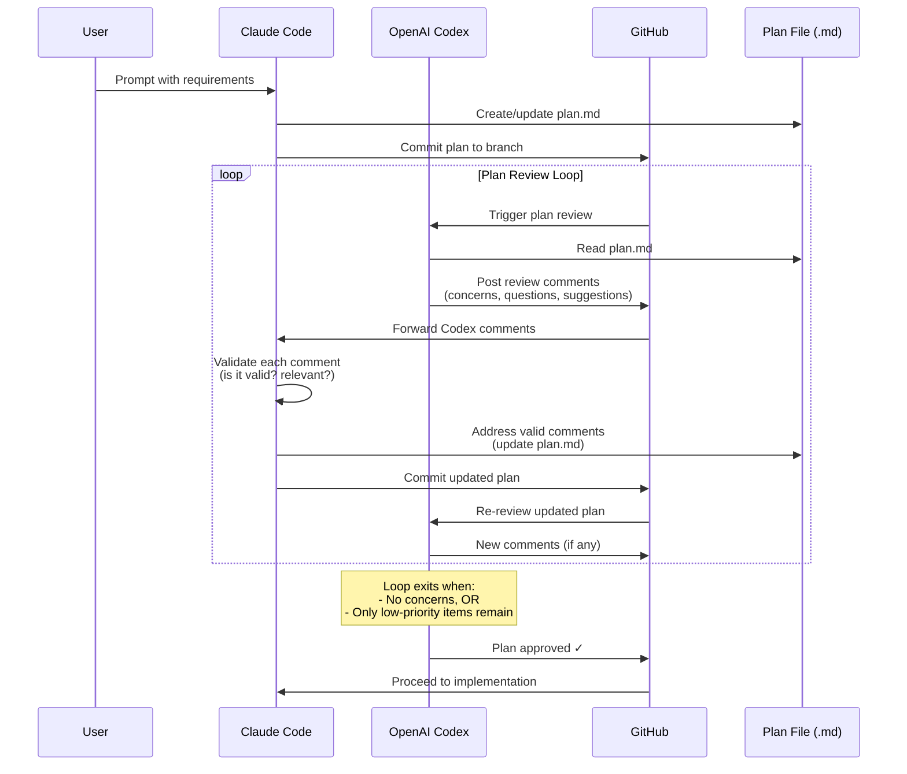
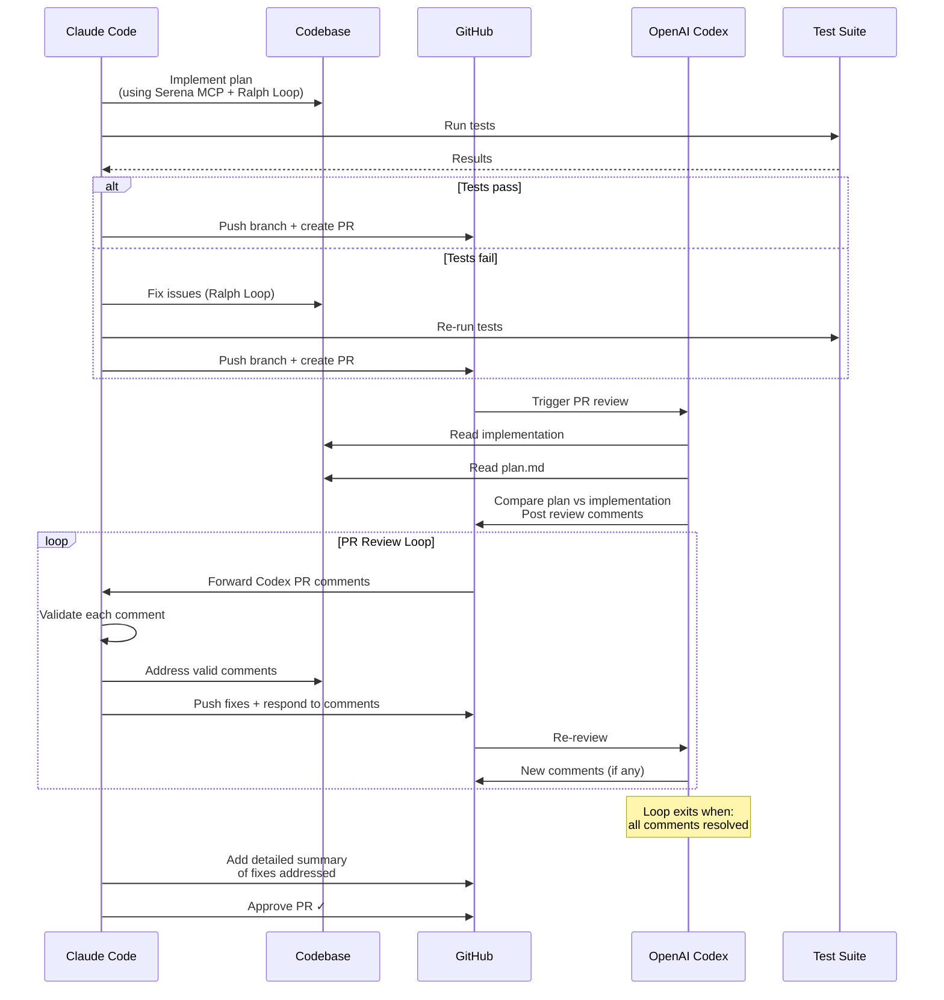
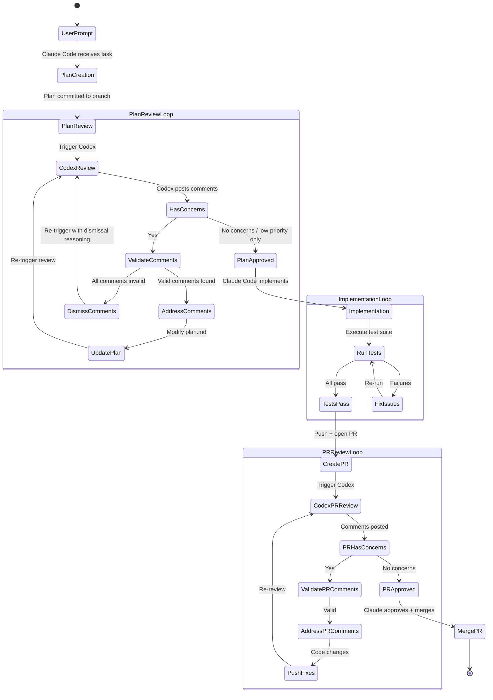
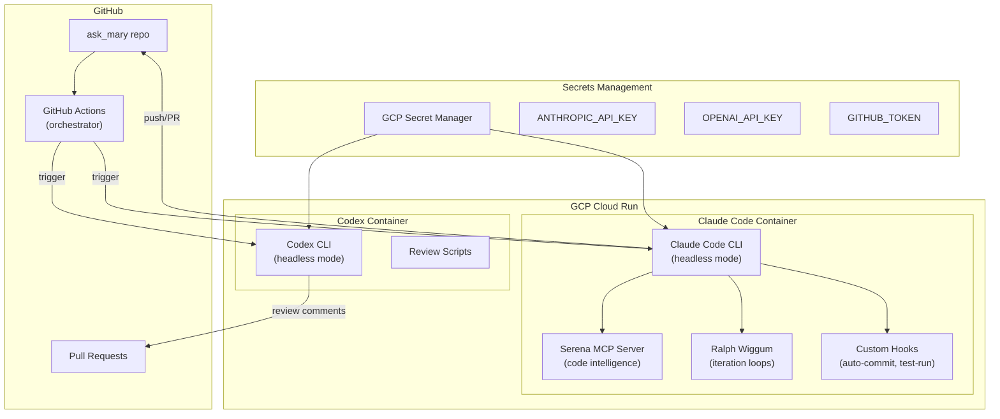
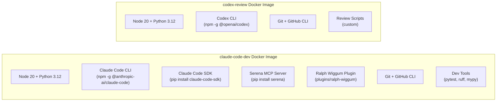

# Agent Development Workflow: Claude Code + Codex Iteration Infrastructure

## Linked from: `ask_mary_plan.md` Phase 1

---

## Table of Contents

1. [Overview](#1-overview)
2. [Iteration Loop Specification](#2-iteration-loop-specification)
3. [Architecture](#3-architecture)
4. [GCP Infrastructure](#4-gcp-infrastructure)
5. [Docker Configuration](#5-docker-configuration)
6. [Claude Code Configuration](#6-claude-code-configuration)
7. [Codex Configuration](#7-codex-configuration)
8. [Automation Scripts](#8-automation-scripts)
9. [Implementation Plan](#9-implementation-plan)
10. [Security Considerations](#10-security-considerations)

---

## 1. Overview

This document defines the infrastructure and automation required to run the **Claude Code + Codex iteration loop** — a continuous plan-then-implement-then-review workflow that enables autonomous code development with structured quality gates.

### Key Components

| Component | Purpose | Runtime |
|-----------|---------|---------|
| **Claude Code** (headless) | Plan creation, implementation, comment response | GCP Docker container |
| **OpenAI Codex** (headless) | Plan review, PR review, comment generation | GCP Docker container |
| **Serena MCP** | Semantic code intelligence for Claude Code | MCP server in container |
| **Ralph Wiggum Plugin** | Autonomous iteration loops for Claude Code | Claude Code plugin |
| **GitHub Actions** | Orchestrates the iteration loop triggers | GitHub-hosted |
| **GCP Cloud Run** | Hosts the dev containers | Google Cloud |

---

## 2. Iteration Loop Specification

### 2.1 Plan Iteration Loop



### 2.2 Implementation + PR Review Loop



### 2.3 Full Lifecycle State Machine



---

## 3. Architecture

### 3.1 Infrastructure Architecture



### 3.2 Container Architecture



---

## 4. GCP Infrastructure

### 4.1 Services Required

| Service | Purpose | Config |
|---------|---------|--------|
| **Cloud Run** | Run dev containers on-demand | Min instances: 0, Max: 2 |
| **Artifact Registry** | Store Docker images | Region: us-central1 |
| **Secret Manager** | API keys and tokens | Auto-rotate enabled |
| **Cloud Build** | Build Docker images | Triggered on Dockerfile changes |
| **Cloud Logging** | Container logs | Retained 30 days |

### 4.2 Estimated Cost (Hackathon)

| Resource | Usage | Cost |
|----------|-------|------|
| Cloud Run (Claude Code) | ~4h/day active | ~$2-5/day |
| Cloud Run (Codex) | ~1h/day active | ~$1-2/day |
| Artifact Registry | 2 images | < $1/day |
| Secret Manager | 3 secrets | < $0.10/day |
| **Total** | | **~$5-10/day** |

---

## 5. Docker Configuration

### 5.1 Claude Code Container

```
# Dockerfile.claude-code
# =====================
# Image: claude-code-dev
# Contains: Claude Code CLI, SDK, Serena MCP, Ralph Wiggum, dev tools

Base: node:20-bookworm
Layers:
  1. System deps (git, python3.12, gh CLI)
  2. Claude Code CLI (npm install -g @anthropic-ai/claude-code)
  3. Claude Code SDK (pip install claude-code-sdk)
  4. Serena MCP (pip install serena)
  5. Ralph Wiggum plugin (copy from anthropics/claude-code repo)
  6. Project dev dependencies (pip install -r requirements-dev.txt)
  7. Custom hooks and automation scripts

Environment:
  - ANTHROPIC_API_KEY (from Secret Manager)
  - GITHUB_TOKEN (from Secret Manager)
  - CLAUDE_CODE_HEADLESS=1

Entrypoint: automation/run_workflow.sh
```

### 5.2 Codex Container

```
# Dockerfile.codex
# =================
# Image: codex-review
# Contains: Codex CLI, review scripts

Base: node:20-bookworm
Layers:
  1. System deps (git, python3.12, gh CLI)
  2. Codex CLI (npm install -g @openai/codex)
  3. Custom review scripts

Environment:
  - OPENAI_API_KEY (from Secret Manager)
  - GITHUB_TOKEN (from Secret Manager)

Entrypoint: automation/run_review.sh
```

---

## 6. Claude Code Configuration

### 6.1 Serena MCP Server Setup

Serena provides IDE-like semantic code intelligence to Claude Code, enabling:
- Symbol-level navigation across 20+ languages
- Semantic code search (not just grep)
- Precise code editing (by symbol, not by line)
- Cross-file reference tracking

**Configuration** (`.claude/settings.json`):
```json
{
  "mcpServers": {
    "serena": {
      "command": "serena",
      "args": ["--project-root", "."],
      "env": {}
    }
  }
}
```

**Why Serena matters for this project**: Our multi-agent codebase will have many interconnected Python modules. Serena gives Claude Code the ability to understand symbol relationships (e.g., "find all callers of `verify_identity()`") rather than doing fragile text grep, which dramatically improves the quality of autonomous refactoring and implementation.

### 6.2 Ralph Wiggum Plugin Setup

Ralph Wiggum enables Claude Code to run in autonomous iteration loops within a session. Instead of stopping after one pass, Claude Code re-reads its prompt and continues working until the task is complete.

**Installation**:
```bash
# Clone the plugin from the official anthropics/claude-code repo
cp -r plugins/ralph-wiggum ~/.claude/plugins/ralph-wiggum
```

**Usage in automation**:
- `/ralph-loop` — Start an autonomous loop in the current session
- `/cancel-ralph` — Cancel the active loop
- The loop continues until: task is fully complete, or max iterations reached

**When to use Ralph**:
- Implementing a full plan (multiple files, multiple steps)
- Large refactors (batch operations across codebase)
- Fixing cascading test failures
- Greenfield builds where completion criteria are clear

### 6.3 Custom Hooks

```json
{
  "hooks": {
    "on_tool_call": [
      {
        "tool": "Write",
        "command": "ruff check --fix ${file_path}"
      }
    ],
    "on_commit": [
      {
        "command": "pytest tests/safety/ --tb=short -q"
      }
    ]
  }
}
```

---

## 7. Codex Configuration

### 7.1 Plan Review Mode

Codex reviews plan files with a structured prompt:

```
Review the implementation plan in local_docs/*.md.

For each section, evaluate:
1. Feasibility: Can this be built in the stated timeframe?
2. Completeness: Are there missing steps or edge cases?
3. Safety: Are there security or compliance gaps?
4. Architecture: Are there better patterns or approaches?
5. Consistency: Does the plan contradict itself anywhere?

Output format:
- CONCERN [HIGH/MEDIUM/LOW]: Description of the concern
- QUESTION: Clarifying question about an ambiguity
- SUGGESTION: Optional improvement (not blocking)

Do NOT flag:
- Style preferences
- Naming conventions (unless confusing)
- Things already marked as TODO/future work
```

### 7.2 PR Review Mode

```
Review this PR against the implementation plan in local_docs/ask_mary_plan.md.

Compare:
1. Does the implementation match the plan?
2. Are there deviations? If so, are they justified?
3. Do all immutable safety tests pass?
4. Are there security vulnerabilities?
5. Is the code maintainable by autonomous agents?

Output format:
- MUST FIX: Blocking issue that must be resolved
- SHOULD FIX: Important but non-blocking
- NIT: Minor suggestion
- QUESTION: Need clarification from implementer
```

---

## 8. Automation Scripts

### 8.1 Workflow Orchestrator (`automation/run_workflow.sh`)

```
#!/bin/bash
# Orchestrates the full Claude Code + Codex iteration loop
# Triggered by GitHub Actions or manually

Phases:
  1. PLAN
     - Claude Code creates plan from user prompt
     - Commits to feature branch
     - Triggers plan review

  2. PLAN_REVIEW
     - Codex reviews plan
     - Posts comments to PR
     - Claude Code addresses comments
     - Loop until approved

  3. IMPLEMENT
     - Claude Code implements plan (with Ralph Loop)
     - Serena MCP for code intelligence
     - Runs tests continuously
     - Pushes implementation PR

  4. PR_REVIEW
     - Codex reviews PR against plan
     - Claude Code addresses comments
     - Loop until approved

  5. MERGE
     - Claude Code approves and merges
     - Triggers deployment pipeline
```

### 8.2 GitHub Actions Workflow

```yaml
# .github/workflows/dev-loop.yml
name: Agent Dev Loop

on:
  workflow_dispatch:
    inputs:
      task_prompt:
        description: 'Task description for Claude Code'
        required: true
      phase:
        description: 'Starting phase'
        type: choice
        options: [plan, implement, review]

jobs:
  claude-code-plan:
    if: inputs.phase == 'plan'
    runs-on: ubuntu-latest
    container:
      image: us-central1-docker.pkg.dev/$PROJECT/ask-mary/claude-code-dev:latest
    steps:
      - checkout
      - run: claude -p "${{ inputs.task_prompt }}" --headless --output-format json

  codex-review:
    needs: claude-code-plan
    runs-on: ubuntu-latest
    container:
      image: us-central1-docker.pkg.dev/$PROJECT/ask-mary/codex-review:latest
    steps:
      - checkout
      - run: codex --approval-mode full-auto -p "Review plan..." --headless

  claude-code-respond:
    needs: codex-review
    runs-on: ubuntu-latest
    container:
      image: us-central1-docker.pkg.dev/$PROJECT/ask-mary/claude-code-dev:latest
    steps:
      - checkout
      - run: claude -p "Address review comments..." --headless
```

---

## 9. Implementation Plan

### Phase Order (fits into Ask Mary Phase 1)

| Step | Task | Duration | Details |
|------|------|----------|---------|
| 9.1 | Create GCP project + enable APIs | 15 min | Cloud Run, Artifact Registry, Secret Manager |
| 9.2 | Store secrets in Secret Manager | 10 min | ANTHROPIC_API_KEY, OPENAI_API_KEY, GITHUB_TOKEN |
| 9.3 | Build Claude Code Docker image | 30 min | Dockerfile with Claude Code, Serena, Ralph Wiggum |
| 9.4 | Build Codex Docker image | 15 min | Dockerfile with Codex CLI + review scripts |
| 9.5 | Push images to Artifact Registry | 10 min | Tag and push both images |
| 9.6 | Deploy to Cloud Run | 15 min | Configure services, env vars, secrets |
| 9.7 | Create GitHub Actions workflows | 20 min | dev-loop.yml with plan/implement/review phases |
| 9.8 | Test iteration loop end-to-end | 20 min | Small test task through full loop |
| **Total** | | **~2.5 hours** | |

**Note**: This can be built in parallel with the main Ask Mary application since it's infrastructure-only.

---

## 10. Security Considerations

| Concern | Mitigation |
|---------|------------|
| API keys in containers | GCP Secret Manager (not env vars in Dockerfile) |
| GitHub token scope | Fine-grained PAT with repo-only access |
| Container escape | Cloud Run sandboxed environment |
| Code injection via prompts | Headless mode limits tool access; hooks validate |
| Cost runaway | Max iterations in Ralph Loop; Cloud Run max instance limits |
| Secrets in logs | Mask secrets in Cloud Logging; no secrets in commit messages |

---

## Sources

- [Claude Code Headless Mode](https://code.claude.com/docs/en/headless)
- [Claude Code Docker Configuration](https://docs.docker.com/ai/sandboxes/claude-code/)
- [Claude Code SDK Docker Containers](https://github.com/cabinlab/claude-code-sdk-docker)
- [Serena MCP Server](https://github.com/oraios/serena)
- [Ralph Wiggum Plugin](https://github.com/anthropics/claude-code/tree/main/plugins/ralph-wiggum)
- [Ralph Wiggum Explained](https://blog.devgenius.io/ralph-wiggum-explained-the-claude-code-loop-that-keeps-going-3250dcc30809)
- [OpenAI Codex CLI](https://developers.openai.com/codex/cli/)
- [Codex Code Review with SDK](https://cookbook.openai.com/examples/codex/build_code_review_with_codex_sdk)
